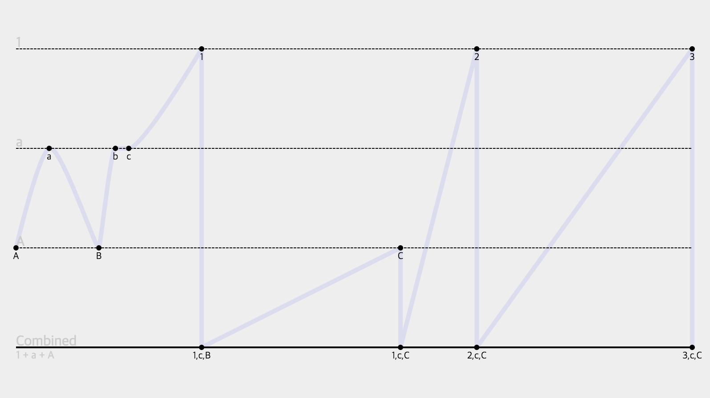

# RxJs Marble Data Renderer



`rxjs-marble-renderer` is visualization RxJs data stream for you.   
Sometimes RxJs data stream is difficult understanding to people.  
(It is mixed by time, data and combine operations...)   

This module help to check RxJs data stream.

But, this module is not completely. (just alpha version)

## Sample Project

- [Website](http://iamssen.github.io/rxjs-marble-renderer/)
- [Source code](https://github.com/iamssen/rxjs-marble-renderer/tree/gh-pages)

## Install with Jspm
```sh
jspm install npm:rxjs-marble-renderer
```

This module is Jspm(=System.js) support only

## Add stylesheet using System.js css plugin
```ts
import 'rxjs-marble-renderer/dist/marble-component.css!';
```

## Create marble data
```ts
import {Marble} from 'rxjs-marble-renderer';

let order:number = 0;
let marble:Marble = new Marble;
const duration:number = 1000 * 0.1;

// create combined stream
marble.newStream('combined', {description: 'Combined', parents: ['1', 'a', 'A']});

Rx.Observable.of<string>('1', 'a', 'A')
	// create streams 1, a, A
	.do((x:string) => marble.newStream(x, {description: `${x}`}))
	.map<number>((x:string) => x.charCodeAt(0))
	.map<Rx.Observable<any>>((x:number) => {
		return Rx.Observable.concat(
			Rx.Observable.of(String.fromCharCode(x)).delay(Math.random() * duration),
			Rx.Observable.of(String.fromCharCode(x + 1)).delay(Math.random() * duration),
			Rx.Observable.of(String.fromCharCode(x + 2)).delay(Math.random() * duration)
			)
			.do(x => marble.getStream(x).add(x, order++)) // collect marble → 1, a, A
	})
	.combineAll()
	.do(x => marble.getStream('combined').add(x, order++)) // collect marble → combined
	.subscribe(
		null,
		e => console.log(`error: ${e}`),
		() => console.log(marble) // finally created marble data
	)
```

## Rendering
### Using `<marble-component/>` in Angular2.0
```html
import {Marble, MarbleComponent} from 'rxjs-marble-renderer';

@Component({
	selector: 'sample-page',
	template: `
	<marble-component width="800" height="450" [marble]="marble"></marble-component>
	`,
	directives: [MarbleComponent]
})
export class SamplePage {
	marble: Marble;
}
```

### Using `render` with `<svg/>`
```html
<svg id="canvas" width="800" height="450"></svg>
```

```ts
import {render} from 'rxjs-marble-renderer';

let canvas:SVGSVGElement = document.getElementById('canvas');
let marble:Marble;

render(canvas, marble.getData());
```

